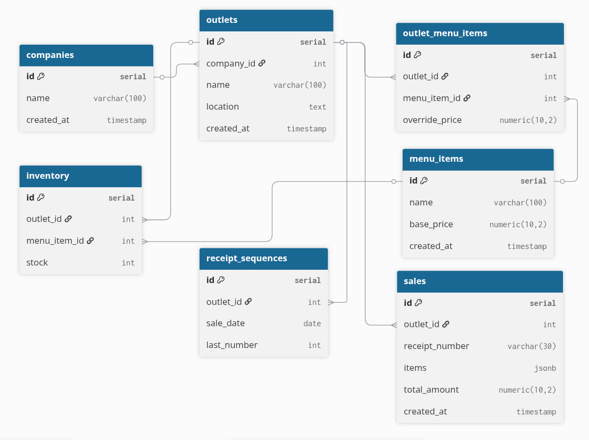

# OmniFlow POS

Multi-outlet point-of-sale system where HQ manages a master menu, assigns items to outlets with optional price overrides, and monitors sales across all locations. Each outlet handles its own sales transactions and inventory.

**Live:** https://omniflow-pos.onrender.com

## Tech Stack

- **Frontend:** React 19, TypeScript, Tailwind CSS 4, Vite
- **Backend:** Express 5, TypeScript, Zod, Helmet
- **Database:** PostgreSQL 15
- **Infra:** Docker, Docker Compose

## Project Structure

```
├── frontend/                 # React SPA
│   └── src/
│       ├── api/              # API client functions
│       ├── components/       # Reusable UI components
│       └── pages/            # Page-level components
├── backend/
│   ├── database/             # SQL schema and seed data
│   └── src/
│       ├── routes/           # Express route definitions + Zod schemas
│       ├── controllers/      # Request/response handling
│       ├── services/         # Business logic
│       ├── repositories/     # Database queries
│       ├── middleware/       # Error handler, validation, 404
│       ├── utils/            # catchAsync
│       └── config/           # DB connection pool
├── docker-compose.yml        # Local dev (PostgreSQL only)
├── Dockerfile                # Production single-container build
├── backend/Dockerfile        # Backend-only container (split deploy)
└── Makefile                  # Dev workflow commands
```

## Setup

### Prerequisites

- Node.js 20+
- Docker

### Local Development

```bash
# Install dependencies
make install

# Start PostgreSQL + backend + frontend
make dev
```

This runs:

- PostgreSQL on `localhost:5432` (via Docker)
- Backend on `localhost:5000` (directly on host)
- Frontend on `localhost:5173` (Vite dev server)

### Other Commands

```bash
make stop        # Kill dev servers + stop PostgreSQL
make db-reset    # Wipe database and re-seed
make seed        # Re-run seed data without wiping
```

### Environment Variables

Backend reads from `backend/.env` (see `backend/.env.example`):

```
DB_HOST=localhost
DB_PORT=5432
DB_NAME=omniflow_pos
DB_USER=postgres
DB_PASSWORD=postgres
PORT=5000
```

For production, set `DATABASE_URL` instead — the app detects it and uses SSL.

## API Endpoints

Base URL: `/api`

### Menu (HQ master menu)

| Method | Endpoint    | Description                             |
| ------ | ----------- | --------------------------------------- |
| GET    | `/menu`     | List all menu items                     |
| GET    | `/menu/:id` | Get one menu item                       |
| POST   | `/menu`     | Create menu item (`name`, `base_price`) |
| PUT    | `/menu/:id` | Update menu item                        |
| DELETE | `/menu/:id` | Delete menu item                        |

### Outlets

| Method | Endpoint                        | Description                                          |
| ------ | ------------------------------- | ---------------------------------------------------- |
| GET    | `/outlets`                      | List all outlets                                     |
| GET    | `/outlets/:id`                  | Get one outlet                                       |
| POST   | `/outlets`                      | Create outlet (`name`, `location?`)                  |
| GET    | `/outlets/:id/menu`             | Get menu items assigned to outlet                    |
| POST   | `/outlets/:id/menu`             | Assign menu item (`menu_item_id`, `override_price?`) |
| DELETE | `/outlets/:id/menu/:menuItemId` | Remove menu item from outlet                         |

### Inventory (per outlet)

| Method | Endpoint                       | Description                         |
| ------ | ------------------------------ | ----------------------------------- |
| GET    | `/outlets/:outletId/inventory` | Get outlet inventory                |
| PUT    | `/outlets/:outletId/inventory` | Set stock (`menu_item_id`, `stock`) |

### Sales (per outlet)

| Method | Endpoint                   | Description             |
| ------ | -------------------------- | ----------------------- |
| GET    | `/outlets/:outletId/sales` | List outlet sales       |
| POST   | `/outlets/:outletId/sales` | Create sale (`items[]`) |

Sale request body:

```json
{
  "items": [{ "menu_item_id": 1, "name": "Burger", "qty": 2, "price": 8.5 }]
}
```

Each sale generates a sequential receipt number per outlet per day: `RCP-{outletId}-{YYYYMMDD}-{0001}`.

### Reports

| Method | Endpoint                               | Description                  |
| ------ | -------------------------------------- | ---------------------------- |
| GET    | `/reports/revenue`                     | Total revenue by outlet      |
| GET    | `/reports/top-items/:outletId?limit=5` | Top selling items per outlet |

### Health

| Method | Endpoint  | Description                |
| ------ | --------- | -------------------------- |
| GET    | `/health` | Returns `{ status: "ok" }` |

## Database Schema

[View ERD on dbdiagram.io](https://dbdiagram.io/d/omniflow-pos-69ae702dcf54053b6f389d01)



Seven tables, designed around the multi-outlet model:

**companies** — Top-level entity. Single company in current scope.

**outlets** — Belongs to a company. Each outlet has its own menu assignments, inventory, and sales.

**menu_items** — Master menu managed by HQ. Has a `base_price` that outlets inherit unless overridden.

**outlet_menu_items** — Junction table linking menu items to outlets. `override_price` is nullable — when null, the outlet uses `base_price`. Unique constraint on `(outlet_id, menu_item_id)` prevents duplicate assignments.

**inventory** — Stock per outlet per menu item. `CHECK (stock >= 0)` enforced at database level so negative stock is impossible even under concurrent requests. Unique constraint on `(outlet_id, menu_item_id)`.

**receipt_sequences** — Tracks the last receipt number per outlet per day. Uses `ON CONFLICT ... DO UPDATE` for atomic increment. Unique on `(outlet_id, sale_date)` so each outlet resets numbering daily.

**sales** — Stores completed transactions. Items are stored as JSONB (denormalized snapshot of what was sold, preserving the price at time of sale). `total_amount` has `CHECK (total_amount > 0)`.

### Key Constraints

- Foreign keys with `ON DELETE CASCADE` from outlets down to inventory, sales, and menu assignments
- `CHECK` constraints prevent negative stock and invalid prices
- `UNIQUE` constraints prevent duplicate menu assignments and inventory entries
- Indexes on `outlet_id` for menu lookups, inventory, and sales queries

## Architecture

```
Client (React) → Express API → Service → Repository → PostgreSQL
```

**Routes** define endpoints and attach Zod validation schemas. **Controllers** parse request params and call services. **Services** contain business logic (validation, orchestrating multiple repos). **Repositories** execute SQL queries against the connection pool.

Errors flow through a global error handler that maps `AppError` instances to HTTP responses, and also translates PostgreSQL constraint violations (23514, 23505, 23503) into user-friendly messages.

Sales creation is wrapped in a database transaction: stock is checked and deducted per item, then the receipt sequence is atomically incremented, and the sale is inserted — all within a single `BEGIN`/`COMMIT` block.

### Concurrency

Receipt numbers stay correct under concurrent requests because `receipt_sequences` uses `INSERT ... ON CONFLICT DO UPDATE` with PostgreSQL's row-level locking. Two concurrent sales for the same outlet on the same day will serialize at the sequence row, so both get unique receipt numbers.

Stock deduction uses `UPDATE ... WHERE stock >= qty` in the same transaction. If stock is insufficient the update affects 0 rows and the transaction rolls back.

## Scaling Strategy

Current design handles a single-instance deployment. For 10 outlets with ~100k transactions/month:

**Database:** Add read replicas for reporting queries. Partition the `sales` table by `outlet_id` or by month so queries against a single outlet don't scan the entire table. Add connection pooling with PgBouncer in front of PostgreSQL.

**Reporting:** Move report generation to materialized views refreshed periodically, or pre-aggregate daily totals into a summary table. This keeps the reporting endpoints fast without scanning raw sales data.

**Infrastructure:** Run the application behind a load balancer with multiple Node.js instances. Since the app is stateless (no sessions, no in-memory state), horizontal scaling is straightforward. Use health check endpoint for load balancer probes.

**Caching:** Add Redis for frequently read data (outlet menus, inventory counts). Invalidate on writes. Reports can be cached with a short TTL since they don't need to be real-time.

**Architectural evolution:** As transaction volume grows, the sales write path becomes the bottleneck. At that point, split sales processing into an async flow: accept the sale request, enqueue it, and process it in a background worker. This decouples the API response time from database write latency.

For detailed architecture documentation including microservices conversion, offline POS strategy, and KDS communication, see [ARCHITECTURE.md](ARCHITECTURE.md).
